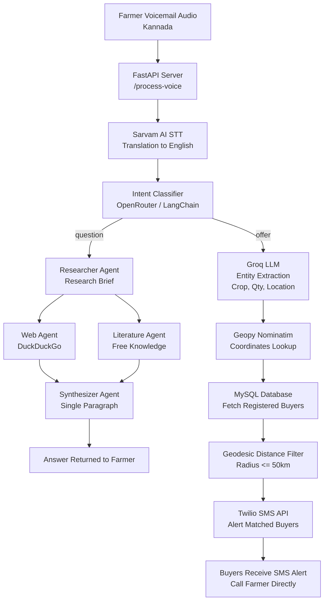

# KrishiX (ಕೃಷಿ-X)

> **AI-Powered Voice-First Agricultural Marketplace & Buyer Dispatch Platform**

KrishiX empowers rural, non-literate, and regional-language-speaking farmers to do more than sell produce. By speaking naturally in their native language (e.g., Kannada) via WhatsApp voicemails or cellular telephony, farmers are **intentionally routed** to one of two capabilities:

1. **Sell produce** — instantly matched with hyper-local registered commodity buyers within their geographic vicinity.
2. **Ask agricultural questions** — answered by an autonomous **agent orchestration** that browses the web and free literature, then returns a single synthesized, farmer-friendly paragraph.

---

## 🌟 Key Features

- 🎙️ **Voice-First Regional Interface**: Accepts voice recordings in Indian languages (default: Kannada `kn-IN`) and translates directly to English using **Sarvam AI's Saaras v4** speech model.
- 🧭 **Intent-Aware Routing**: A classifier (OpenRouter) studies each transcribed message and routes it to the **offer pipeline** or the **Q&A agent pipeline**.
- 🛒 **Sell-Offer Pipeline**: **Groq** (`openai/gpt-oss-20b`) extracts crop, quantity (with units), and location into structured JSON; **Geopy (Nominatim)** resolves the location; a **geodesic** filter (default 50 km) finds nearby registered buyers; **Twilio SMS** notifies them instantly.
- 🤖 **Agricultural Q&A Agents (LangGraph Orchestration)**: For questions, a `researcher` agent produces a research brief, then two agents gather information **in parallel** — a `web_agent` (DuckDuckGo, no API key) and a `literature_agent` (free/public-domain knowledge) — and a `synthesizer` merges both into a single paragraph using an **OpenRouter** model.
- 🖥️ **Desktop Voicemail Client**: Simple Tkinter GUI for agricultural coordinators and mandi operators to test, upload, and process voicemails.
- 🔒 **Enterprise-Grade Security**: Environment-driven architecture ensuring no credentials or API keys are committed to version control.

---

## 🏗️ Architecture & Data Flow



---

## 📁 Repository Structure

```
KrishiX/
├── .env                  # Local environment configuration & secrets (GITIGNORED)
├── env.example           # Template environment file with setup instructions
├── .gitignore            # Git exclusion rules for secrets, caches, and temp files
├── LICENSE               # Project License (GNU GPL v3)
├── README.md             # Project documentation and developer guide
├── requirements.txt      # Python dependencies
│
├── app/                  # Core FastAPI Backend Application
│   ├── __init__.py
│   ├── config.py         # Centralized configuration & environment loader
│   ├── database.py       # MySQL connection pool & buyer queries
│   ├── main.py           # FastAPI server entrypoint & API routes
│   ├── agents/           # Agent orchestration (classification + Q&A)
│   │   ├── __init__.py
│   │   ├── classifier.py     # Intent classifier (offer vs question)
│   │   ├── qa.py             # LangGraph Q&A workflow (researcher/web/literature/synthesizer)
│   │   ├── orchestrator.py   # route_message() entry point
│   │   └── utils.py          # OpenRouter LLM factory & web-search tool
│   └── services/         # Modular micro-service integrations
│       ├── __init__.py
│       ├── speech.py     # Sarvam AI audio translation service
│       ├── llm.py        # Groq entity extraction service
│       ├── geo.py        # Geocoding & proximity distance filter
│       └── notifier.py   # Twilio outbound SMS notification service
│
├── client/               # Client Applications
│   ├── __init__.py
│   └── gui.py            # Tkinter desktop voicemail uploader app
│
├── docs/                 # Documentation
│   └── TESTING.md        # Feature-by-feature testing guide
│
└── scripts/              # Setup and Utility Scripts
    ├── schema.sql        # MySQL database schema & Karnataka seed data
    └── tunnel.py         # Ngrok public reverse-proxy forwarder
```

---

## 🚀 Quick Start Guide

### 1. Prerequisites

- **Python**: 3.10, 3.11, or 3.12+
- **MySQL**: 8.0+ running locally or in the cloud
- **Accounts & API Keys**:
  - [Sarvam AI](https://dashboard.sarvam.ai/) API Key
  - [Groq Console](https://console.groq.com/keys) API Key
  - [Twilio Account](https://console.twilio.com/) SID, Auth Token & SMS Phone Number
  - [OpenRouter](https://openrouter.ai/keys) API Key (for the Q&A agent orchestration)
  - [Ngrok](https://ngrok.com/) Account (Optional, for public webhooks)

> **Note:** The `web_agent` uses DuckDuckGo search, which requires **no API key**.

---

### 📖 Testing Guide

For a detailed feature-by-feature testing procedure and the purpose of each component, see **[docs/TESTING.md](docs/TESTING.md)**.

---

### 2. Installation

Clone the repository and install the dependencies:

```bash
# Clone the repository
git clone https://github.com/your-username/KrishiX.git
cd KrishiX

# Create and activate a virtual environment
python -m venv .venv
# On Windows:
.venv\Scripts\activate
# On Linux/macOS:
source .venv/bin/activate

# Install required dependencies
pip install -r requirements.txt
```

---

### 3. Environment Configuration

Copy the example environment file:

```bash
copy env.example .env     # Windows
# or: cp env.example .env # Linux/macOS
```

Open `.env` and fill in your actual credentials:

```ini
# Sarvam AI Configuration
SARVAM_API_KEY=your_sarvam_api_key_here
SARVAM_MODEL=saaras:v4
SARVAM_DEFAULT_LANGUAGE=kn-IN

# Groq LLM Configuration
GROQ_API_KEY=your_groq_api_key_here
GROQ_MODEL=openai/gpt-oss-20b

# Twilio Configuration
TWILIO_SID=your_twilio_sid_here
TWILIO_AUTH_TOKEN=your_twilio_auth_token_here
TWILIO_PHONE_NUMBER=+1234567890

# MySQL Database
DB_HOST=localhost
DB_PORT=3306
DB_USER=root
DB_PASSWORD=your_db_password
DB_NAME=agrimatch

# Server Settings
API_HOST=127.0.0.1
API_PORT=8000
API_URL=http://127.0.0.1:8000/process-voice

# Proximity Matching Threshold (Kilometers)
MATCH_RADIUS_KM=50

# OpenRouter (Agricultural Q&A Agent Orchestration)
OPENROUTER_API_KEY=your_openrouter_api_key_here
OR_AGENT_MODEL=nvidia/nemotron-3-ultra-550b-a55b:free
OR_MAX_RESULTS=4
```

---

### 4. Database Setup

Ensure MySQL is running, then execute the initialization script to create the `agrimatch` database, `buyers` table, and sample buyers:

```bash
mysql -u root -p < scripts/schema.sql
```

---

### 5. Running the Application

#### A. Start the Backend API Server
```bash
# Using uvicorn directly:
uvicorn app.main:app --reload --host 127.0.0.1 --port 8000

# Or using python module:
python -m app.main
```
The server will be live at `http://127.0.0.1:8000`.  
Interactive Swagger documentation is available at `http://127.0.0.1:8000/docs`.

#### B. Launch the Desktop Client
In a separate terminal:
```bash
python client/gui.py
```
1. Click **Browse Audio File** to choose an audio message (`.ogg`, `.opus`, `.mp3`, `.wav`, etc.).
2. Enter the farmer's contact phone number.
3. Click **Upload & Match Buyers**.
4. View the translation, extracted entities, and dispatch status in the live console.

#### C. Expose to Public Internet (Optional)
To receive webhooks from WhatsApp Cloud API or Twilio Voice:
```bash
python scripts/tunnel.py
```

---

## 📡 API Reference

### Health Check
- **`GET /health`**
- **Response**:
  ```json
  {
    "status": "ok",
    "service": "KrishiX API",
    "version": "1.0.0"
  }
  ```

### Process Farmer Voice
- **`POST /process-voice`**
- **Request (Multipart Form Data)**:
  - `file`: Audio file (`.ogg`, `.opus`, `.wav`, `.mp3`, `.m4a`)
  - `farmer_phone`: String (e.g., `+919876543210`)
- **Success Response — Offer (200 OK)**:
  ```json
  {
    "status": "success",
    "type": "offer",
    "intent": "offer",
    "confidence": 0.98,
    "reason": "Farmer is selling 5 quintals of tomato in Mandya.",
    "translation": "I have 5 quintals of fresh tomatoes available in Mandya.",
    "extracted_data": {
      "crop": "tomato",
      "qty": "5 quintals",
      "location": "Mandya"
    },
    "buyers_alerted": 2,
    "matched_buyers_count": 2
  }
  ```
- **Success Response — Question (200 OK)**:
  ```json
  {
    "status": "success",
    "type": "question",
    "intent": "question",
    "confidence": 0.97,
    "reason": "Farmer is asking how to control tomato blight.",
    "translation": "How do I control tomato blight in my field?",
    "answer": "Tomato blight (early and late) is best controlled by... "
  }
  ```
  The `answer` field contains the single synthesized paragraph produced by the Q&A agent orchestration (web + literature findings).

---

## 🛡️ Security & Privacy

- **Never commit `.env`**: Always ensure `.env` remains in `.gitignore`.
- **Audio Cleanup**: Temporary files (`temp_*`) created during voice processing are automatically deleted in a `try...finally` block, ensuring no audio residual data remains on disk.

---

## 📄 License

This project is licensed under the terms described in the [LICENSE](LICENSE) file.
